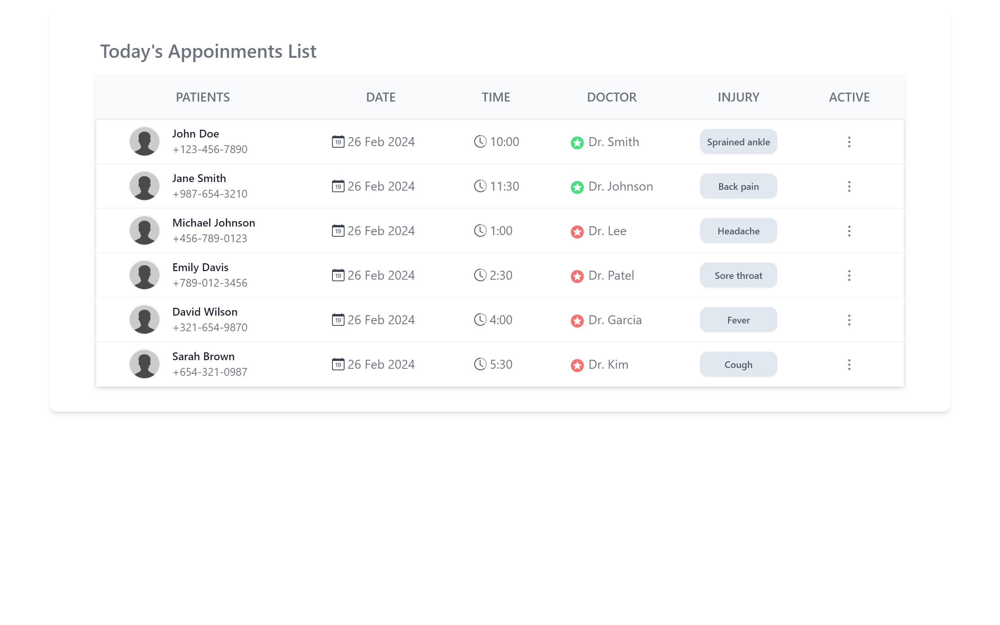

# Telematum Appointment Management System

This is a simple appointment management system built using React. It fetches appointment data from an external API and displays it in a tabular format.

## Features

- Display appointments with patient details, appointment date, time, doctor, and injury information.
- Format appointment date in "DD-MMM-YYYY" format (e.g., 26-Feb-2024).
- Display appointment time with color indication (green for AM and red for PM) without "AM" or "PM" indicator.
- Use professional box shadow for styling.


## How to Run Locally

To run this project locally, follow these steps:

1. Clone the repository:

   ```bash
   git clone https://github.com/Preetiraj3697/Telematum-React-Assessment.git
   ```

2. Navigate to the project directory:

   ```bash
   cd Telematum-React-Assessment
   ```

3. Install dependencies:

   ```bash
   npm install
   ```

4. Start the development server:

   ```bash
   npm start
   ```

5. Open your browser and go to `http://localhost:3000` to view the application.

## Screenshots




## Dependencies

- React: A JavaScript library for building user interfaces.
- react-icons: A library providing a set of icons for React applications.
- Tailwind CSS: A utility-first CSS framework for quickly building custom designs.

  
## Project Structure

- `src/`: Contains the source code for the project.
  - `components/`: Contains React components used in the application.
  - `images/`: Contains images used in the application.
  - `App.js`: Main component that renders the application.
  - `TableCard.js`: Component responsible for displaying appointment data in a table format.
- `public/`: Contains static assets and the HTML file for the application.
- `README.md`: Documentation for the project.

 
## Credits
- Icons provided by [React Icons](https://react-icons.github.io/react-icons/).
- Data provided by the external API.
  
This project was created by Preeti Raj. Feel free to contribute or provide feedback!
